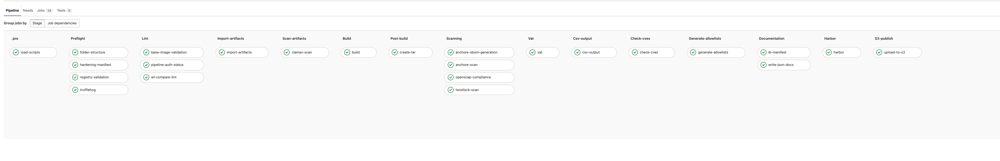

# Why do we need to create hardened container images? 
Baseline container image is a container image that you standardize through configuration, consistent security patching and hardening. 
 
Organizations who are using Kubernetes and Containerization in their solution need a repeatable process to 
Distribute the baseline hardened container images to their business units 
Continuously asses the security posture of all active baseline container images 
Release and version management 
 
# Baseline Container Image Pipeline 
 
 
# Advantages: 
- Automated process to generate new container image when there is new upstream release or security patch release. 
- Distribute container image as base layer which will inherit all the security controls applied. 
- Versions of the container image. 
- Continuously assess the security posture of all active golden AMI’s (Amazon Machine Image). 
