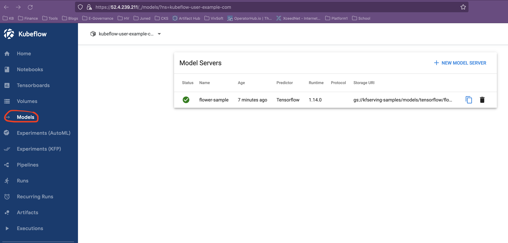
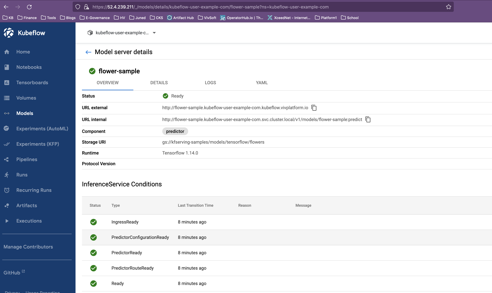
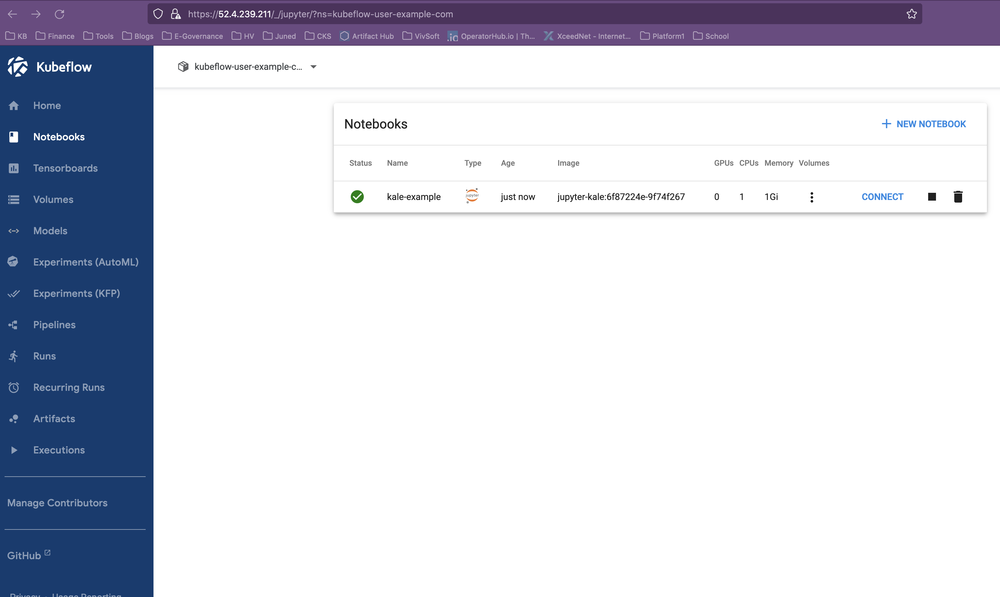
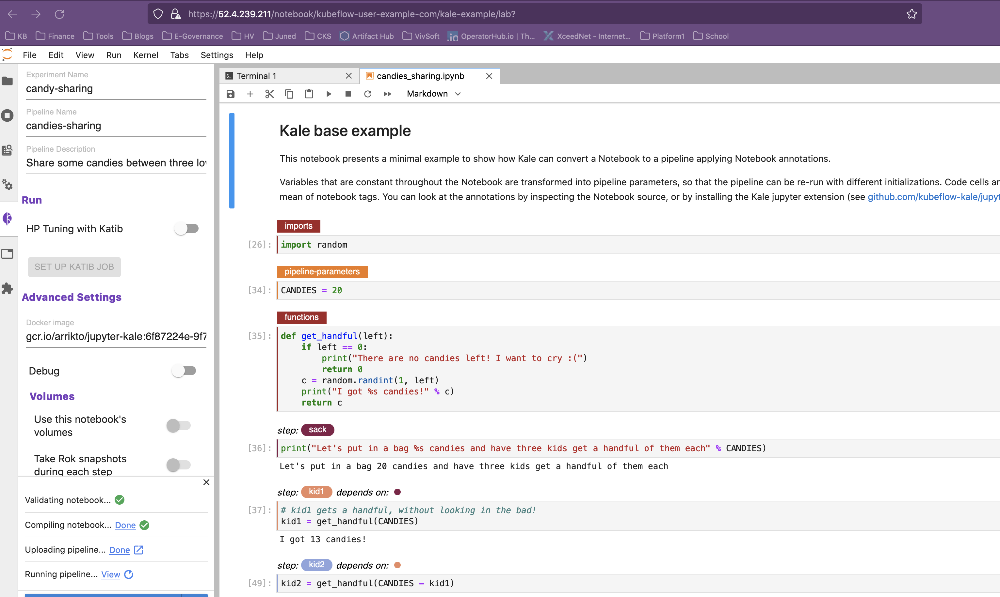
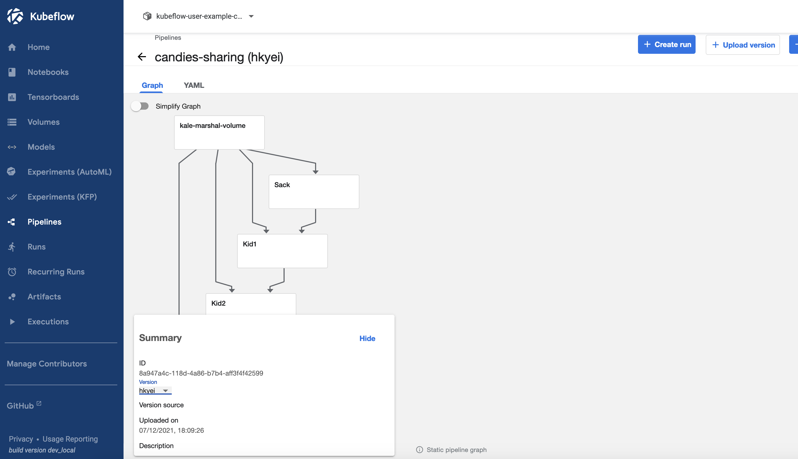
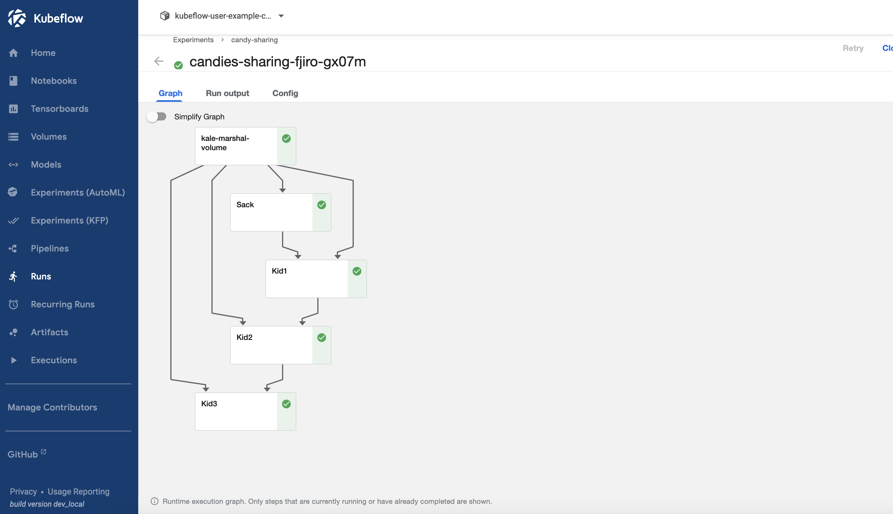

# MLOPs (Machine Learning Ops) Development with Kubeflow 
 
## This folder highlights the following technologies used within the N2X environment to deploy MLOps  
 
1. Certmanager 
2. Istio 
3. Dex 
4. Knative 
5. KubeFlow 
6. Katib 
7. Jupyter Notebooks 
8. Tensorboard 
9. Mpi-operator 
 
------------ 
# Access the KubeFlow Dashboard 
 
After installing you can access the Kubeflow dashboard using the https URL of the `istio-ingressgateway` 
which you can find using  
 
``` 
kubectl get svc istio-ingressgateway -n istio-system -o jsonpath='{.status.loadBalancer.ingress[*].ip}' 
``` 
 
In case of cluster is running k3s, you can directly hit the https://k3s_public_IP  
 
The default username is kubeflow@vivsoft.io and password is **Viv$0ft** 
 
 
 
# Model Serving 
You can create the example Inference Service as below  
 
``` 
kubectl apply -f example/tensorflow.yaml 
``` 
 
You can create the same sample model from UI (User Interface) , as  
home --> Models --> New Model Server and paste the contents of `example/tensorflow.yaml` in the box and hit CREATE. 
 
Get the details of inference service and Serving URL  
 
``` 
kubectl get inferenceservice -A 
NAMESPACE                   NAME            URL                                                                      READY   PREV   LATEST   PREVROLLEDOUTREVISION   LATESTREADYREVISION                     AGE 
kubeflow-user-example-com   flower-sample   http://flower-sample.kubeflow-user-example-com.kubeflow.vivplatform.io   True           100                              flower-sample-predictor-default-00001   74s 
``` 
 
You can get the same from the UI , as  
 
Home --> Models --> flower-sample  
 
 
 
 
 
 
 
### Test the Models by sending the prediction requests to the Inference Service 
 
Before we hit the serving URL, we need to get the `authservice_session` , Follow [this Steps to get the Cookie details for authentication] (https://github.com/kserve/kserve/blob/master/docs/samples/istio-dex/README.md#authentication)  
 
and export the SESSION variable.  
 
``` 
export SESSION=MTYzODg3NzYxNHxOd3dBTkZCYVFsVkdSVUZRVlZwTlNGVkJVMFZOUVZvMlFsUkpTRXBSVWpOWlNreFpRelEyUkU5SlVsZElWRkJTU1V0T1FUZElOMUU9fPRwPVbsDYkZ532bMGnD5qhGC-xd8VoM40xPEW86oUYw 
``` 
 
The sample input for flower `inferenceservice` is present at `example/flowers-input.json` , just run the below curl command, change the URL according to your deployment. It should be IP of the `istio-ingressgateway` service.  
 
We are sending the Host Header as the DNS might not present.  
 
``` 
curl  -X POST  -H "Host:flower-sample.kubeflow-user-example-com.kubeflow.vivplatform.io" -H 'Content-Type: application/json' -H "Cookie: authservice_session=${SESSION}" -d @example/flowers-input.json  http://52.4.239.211/v1/models/flower-sample:predict 
{ 
    "predictions": [ 
        { 
            "scores": [0.999114931, 9.20987e-05, 0.000136786475, 0.000337257865, 0.000300532585, 1.84813616e-05], 
            "prediction": 0, 
            "key": "   1" 
        } 
    ] 
} 
``` 
 
 
 
# Creating Notebook Server and Developing  Kubeflow Pipeline using KALE 
There is sample Notebook server deployment at `example/kale-example-notebooks.yaml` which uses the official kale `gcr.io/arrikto/jupyter-kale:6f87224e-9f74f267` image and other configuration.  
 
Deploy the notebook using below command  
 
``` 
kubectl apply -f example/kale-example-notebooks.yaml 
``` 
 
This will deploy the notebook server. Check its status and connect to it from UI  
 
 
 
 
 
Connect the notebook server, start a terminal, and clone the example manifests from official kale repo. 
 
``` 
git clone https://github.com/kubeflow-kale/examples.git 
``` 
Use the `examples/base/candies_sharing.ipynb` as example.  
 
Open the `examples/base/candies_sharing.ipynb` notebook.  
 
Enable the **Kale extension**, provide the experiment details etc. and then compile and run. 
 
***Make a note that the depending on your cluster you need to change the volume access mode default is  `ReadWriteMany` which will not work in `k3s` deployment. So, you can change it to `ReadWriteOnce`*** 
 
 
 
 
 
- This will create the experiment (if it does not exist). You can check it in UI as, Home --> Experiments KFP. 
 
- Compile the Notebook into Kubeflow pipeline and upload it. You can check it Home--> Pipelines. 
 
   
 
- Create the run for that pipeline. You can check it in Home --> Runs.  
 
   
 
 
 
For other notebooks like titanic, you must create a new docker image with all your python modules and data, otherwise your pipeline step will fail. Refer [Kale - FAQ](https://github.com/kubeflow-kale/kale/blob/master/FAQ.md) for details. 
 
# References 
 
- [Connecting to Kubeflow Pipelines using the SDK (Software Development Kit) client](https://www.kubeflow.org/docs/components/pipelines/sdk/connect-api/) 
- [Creating Notebook Server](https://www.kubeflow.org/docs/components/notebooks/quickstart-guide/#create-a-jupyter-notebook-server-and-add-a-notebook) 
- [Kale - FAQ](https://github.com/kubeflow-kale/kale/blob/master/FAQ.md)  
 
# Pending Items 
 
### Following changes are added in cloned manifest to make it work with our setup. We need to create kustomize patch for these. 
 
- Updated the `kubeflow-manifests/common/dex/base/config-map.yaml` to update the default password 
 
``` 
+++ b/kubeflow-manifests/common/dex/base/config-map.yaml 
@@ -18,8 +18,8 @@ data: 
       skipApprovalScreen: true 
     enablePasswordDB: true 
     staticPasswords: 
-    - email: user@example.com 
-      hash: $2y$12$4K/VkmDd1q1Orb3xAt82zu8gk7Ad6ReFR4LCP9UeYE90NLiN9Df72 
+    - email: kubeflow@vivsoft.io 
+      hash: $2y$12$pFuk.RkwtyS0teiJij9Kz.XW54j5RpaYc3X3aKu8RHMtJ1Xym/TEK 
       # https://github.com/dexidp/dex/pull/1601/commits 
       # FIXME: Use hashFromEnv instead 
       username: user 
``` 
 
To generate the bcrypt hash for our password `Viv$0ft` use  
 
``` 
python3 -c 'from passlib.hash import bcrypt; import getpass; print(bcrypt.using(rounds=12, ident="2y").hash(getpass.getpass()))' 
 
``` 
 
- Updated the `kubeflow-manifests/common/istio-1-9/kubeflow-istio-resources/base/kf-istio-resources.yaml` and added the https in gateway too 
 
``` 
@@ -12,3 +12,12 @@ spec: 
       protocol: HTTP 
     hosts: 
     - "*" 
+  - hosts: 
+    - '*' 
+    port: 
+      name: https 
+      number: 443 
+      protocol: HTTPS 
+    tls: 
+      credentialName: public-cert 
+      mode: SIMPLE 
``` 
 
- updated the `kubeflow-manifests/common/knative/knative-serving/base/upstream/net-istio.yaml` and added the domain ***kubeflow.vivplatform.io*** 
 
``` 
@@ -156,6 +156,7 @@ metadata: 
     serving.knative.dev/release: "v0.22.1" 
     networking.knative.dev/ingress-provider: istio 
 data: 
+  kubeflow.vivplatform.io: "" 
   _example: | 
     ################################ 
     #                              # 
``` 
 
- updated the `kubeflow-manifests/common/knative/knative-serving/base/upstream/serving-core.yaml` and added the domain ***kubeflow.vivplatform.io*** 
 
``` 
diff --git a/kubeflow-manifests/common/knative/knative-serving/base/upstream/serving-core.yaml b/kubeflow-manifests/common/knative/knative-serving/base/upstream/serving-core.yaml 
index b2cab46..ee6d7c8 100644 
--- a/kubeflow-manifests/common/knative/knative-serving/base/upstream/serving-core.yaml 
+++ b/kubeflow-manifests/common/knative/knative-serving/base/upstream/serving-core.yaml 
@@ -1036,6 +1036,7 @@ metadata: 
   annotations: 
     knative.dev/example-checksum: "74c3fc6a" 
 data: 
+  kubeflow.vivplatform.io: "" 
   _example: | 
     ################################ 
     #                              # 
 
``` 
 
- updated the `kubeflow-manifests/common/user-namespace/base/params.env`  to update the default user to **kubeflow@vivsoft.io** 
 
``` 
diff --git a/kubeflow-manifests/common/user-namespace/base/params.env b/kubeflow-manifests/common/user-namespace/base/params.env 
index 9459383..a58309f 100644 
--- a/kubeflow-manifests/common/user-namespace/base/params.env 
+++ b/kubeflow-manifests/common/user-namespace/base/params.env 
@@ -1,2 +1,2 @@ 
-user=user@example.com 
+user=kubeflow@vivsoft.io 
 profile-name=kubeflow-user-example-com 
``` 
