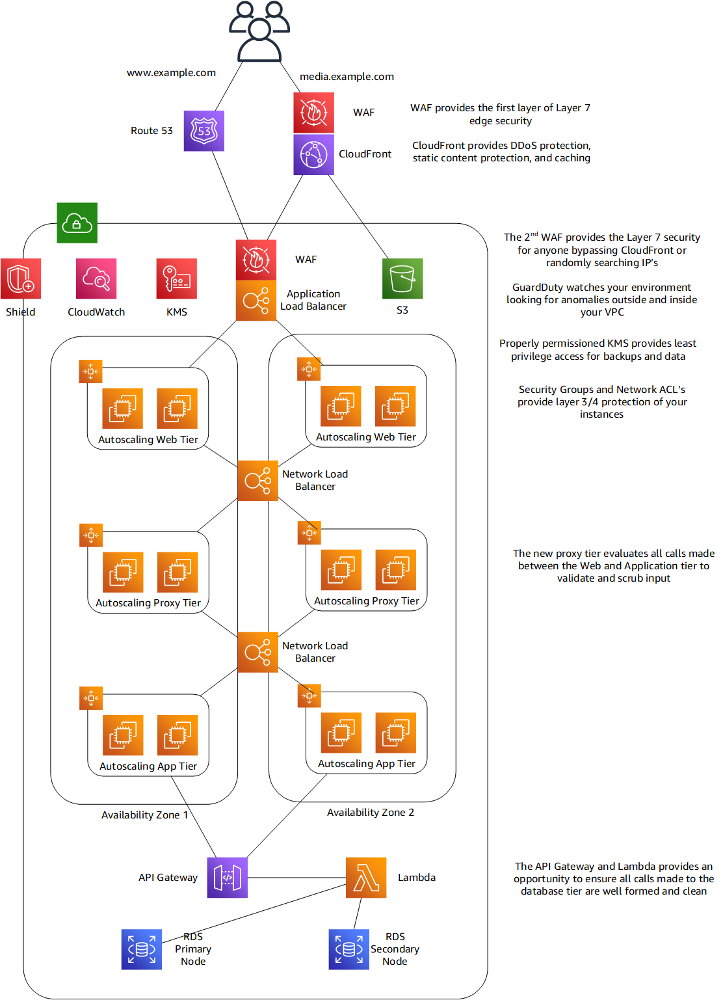
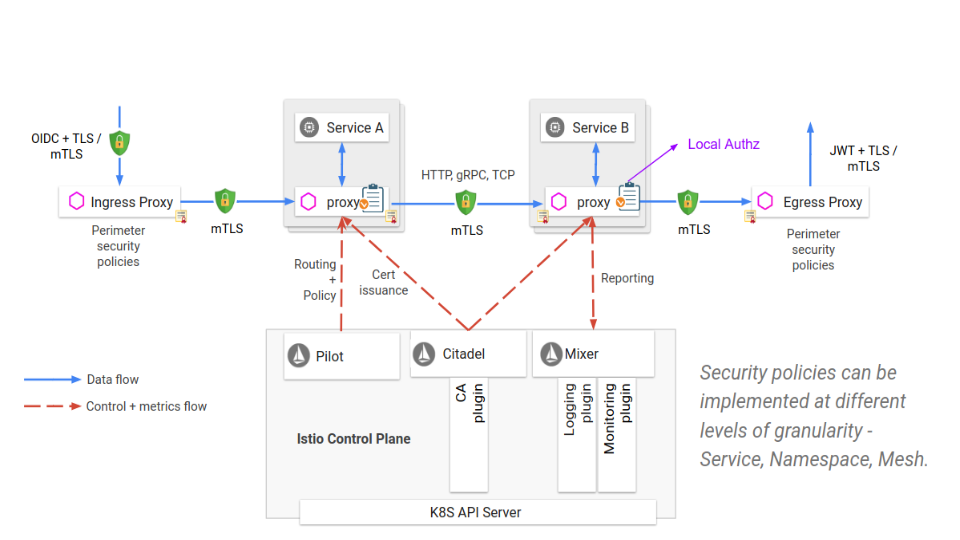
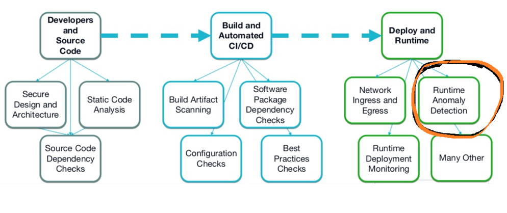
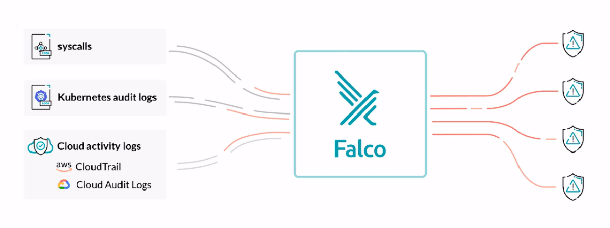
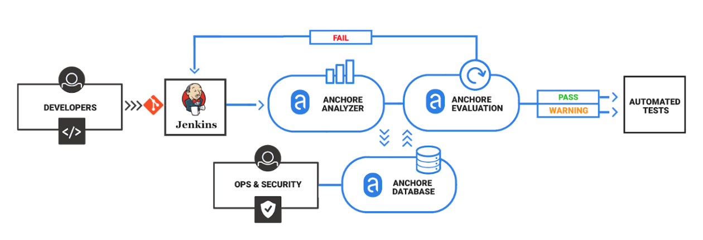
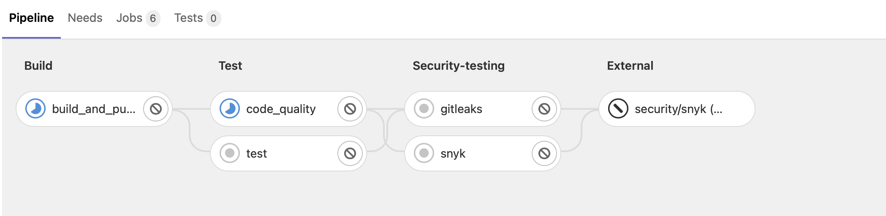

# Zero trust 
## What is Zero Trust? 
 
Zero Trust security is a model where application components or microservices are considered discrete from each other and no component or microservice trusts any other. This manifests as a security posture designed to consider input from any source as potentially malicious. It starts with not trusting the underlying internal network fabric and extending to things such as input and output validation at every microservice. Additional efforts can include designing a defense-in-depth approach to protect against individual components, microservices, or identities compromise. 
 
Designing on AWS (Amazon Web Services) using Zero Trust principles 
To better understand Zero Trust architectures, let us use threat modeling to compare them to traditional and cloud-native architectures. In threat modeling, users attempt to determine all the potential attack possibilities to define risk and identify mitigations. One threat model that can be used for illustrative purposes, STRIDE, identifies threats in these categories: 
 
- Spoofing of user identity 
- Tampering with data 
- Repudiation the source 
- Information disclosure 
- Denial of service 
- Elevation of privilege 
 
### Applying Zero trust in AWS 
 
Zero Trust model requires all components and communications be considered untrusted. 
- Implement additional metrics and monitoring so a consistent amount of traffic flows from each instance. 
- Implement Amazon CloudWatch Anomaly Detection to use machine learning (ML) algorithms to analyze specific metrics such as Amazon EC2 instances generating unusually large amounts of network traffic. 
- Use the alarm to notify an AWS SNS (Simple Notification Service)) topic, which will then trigger a custom Amazon Lambda function that removes the offending Amazon EC2 instance for the auto-scaling group, stops it, and isolates it for further analysis. 
 
To protect against information disclosure, tampering, and afford some level or repudiation, leverage encryption and least privilege. We use AWS KMS (Key Management Service) with IAM 
 
 
 
 
### Applying Zero Trust with Service Mesh in Kubernetes 
The Istio security features provide strong identity, powerful policy, transparent TLS (Transport Layer Security) encryption, and authentication, authorization, and audit (AAA) tools to protect your services and data. The goals of Istio security are: 
 
**Security by default**: no changes needed for application code and infrastructure 
**Defense in depth**: integrate with existing security systems to provide multiple layers of defense 
**Zero-trust network**: build security solutions on untrusted networks 
 
 
 
Security in Istio involves multiple components: 
 
- **Citadel** for key and certificate management 
- **Sidecar** and perimeter proxies to implement secure communication and authorization between clients and servers 
- **Pilot** to distribute authentication policies and secure naming information to the proxies 
- **Mixer** to manage auditing 
 
What can be achieved with using Istio service mesh: 
 
- Generating and signing certificates for services inside Kubernetes as out of the box feature. 
- Transport Mutual TLS Authentication 
- Origin Mutal TLS authentication 
- Permissive mode to allow a service to accept both plaintext traffic and mTLS traffic at the same time to have a great onboarding experience 
- Secure Naming 
- Authentication Policies 
- Authorization 
- Auth Mechanisms 
 
# Security in Depth 
 
As Kubernetes continues to grow in adoption, it is important for us to know how to secure it. In a dynamic infrastructure platform such as Kubernetes, detecting and addressing threats is important but also challenging at the same time. 
 
Information security is a process that moves through phases building and strengthening itself along the way. Security is a journey, not a destination. Although the Information Security process has multiple strategies and activities, we can group them all into three distinct phases - prevention, detection, and response. 
 
 
(https://github.com/VivSoftOrg/VivSoft_ACME_Phase2/edit/main/Security/images/falco-securing-the-layers.jpeg) 
 
## Preventive measures 
Preventive measures include having proper access control, authentication, and authorization in place. No matter what level of protection a system may have, it will get compromised given a greater level of motivation and skill. There is no foolproof “silver bullet” security solution. A defense in-depth strategy should be deployed so when each layer fails, it fails safely to a known state and sounds an alarm. The most crucial element of this strategy is timely detection and notification of a compromise. 
 
## Detective measures 
An example of detective measures includes sending logs from security and network devices like host-based intrusion detection systems (HIDS) and network intrusion detection systems (NIDS) to an SIEM (Security Information and Event Management) and building rules to alert when suspicious activity is seen. According to the defense in-depth approach, we should be auditing and placing detection triggers on multiple layers of the technology stack, from looking at cloud audit logs (like CloudTrail), the Kubernetes cluster, containers, application code, host OS (Operating System) and the kernel. We will take a look at the detective measures in this blog which will further help us to respond to these threats. 
 
## Security 
 
### Enforcement 
- seccomp 
- seccomp-bpf 
- SELinux 
- AppArmor 
 
### Auditing 
- auditd 
- Falco 
- Anchore 
- Snyk 
- Twistlock 
 
### Security as first class citizen in pipelines 
 
 
### Falco Runtime Security 
 
 
### Anchore 
 
 
### Synk Scan Pipeline 
 
