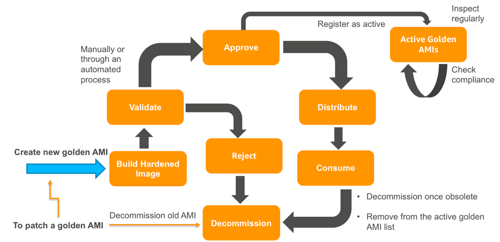
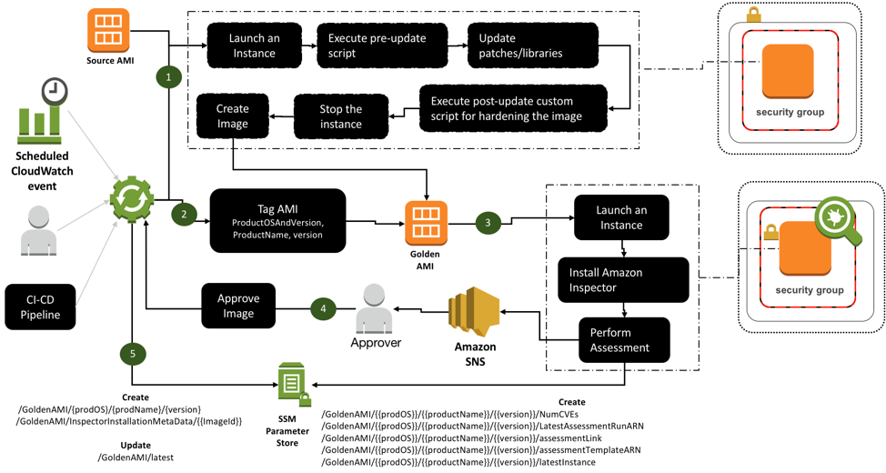

# Why do we need to Build Golden Base AMI? 
 
Golden AMI (Amazon Machine Image) is an AMI that you standardize through configuration, consistent security patching and hardening. It also contains agents that you approve for logging, security, performance monitoring etc. Customers have also expressed desire to establish repeatable process to  
 
1. Distribute the golden AMI’s to their business units 
2. Continuously assess the security posture of all active golden AMIS 
3. Decommission golden AMI’s once obsolete 
 
# Golden AMI Pipeline 
The golden AMI pipeline enables creation, distribution, verification, launch-compliance, and decommissioning of the golden AMI out of the box. The following diagram highlights the high-level workflow. 
 
 
 
 
Once you create golden AMI is created, we can validate the image and then either approve or reject which will trigger the end stage of lifecycle of the AMI. 
It is a standard DevOps best practice to establish golden AMIs (and the resulting running instances) as immutable objects and to manage any changes through a standard pipeline. Golden AMI pipeline follows the same best practice and enables the requirement of patching by allowing you to decommission an affected golden AMI version and creating a new one. Also, over time, a golden AMI version becomes obsolete. We can decommission the version by executing an automation set up by the pipeline. 
# Architecture diagram of the golden AMI creation process: 
 
# Process of Building Golden AMI 
 
This configuration assumes that a golden AMI we want to create is a: 
 
- AMI with all DISA (Defense Information Systems Agency) STIGs (Security Technical Implementation Guides) applied. 
- Standardized golden OS-AMI that you want to distribute to accounts or line of businesses (LOBs) in our organization for consumption: 
- For general use like a bastion host. 
- As an input base AMI for creating a standardized application specific golden AMI. 
- Is a standardized application specific golden AMI you want to let our business unit(s)/users deploy in their environment. 
 
The repository contains sample CloudFormation (CFN) templates and a readme guide. We can use the CloudFormation Templates to set up the pipeline, however, instructions on how and where to execute these CloudFormation templates are available in the readme guide. The readme guide is a detailed step-by-step instruction guide, which contains instructions to: 
 
Process : 
- Set up the pipeline infrastructure in the master account. Note that if you are using AWS organizations, this is not the master-payer account. It is an account that our Cloud Center of Excellence (CCOE) team has identified as the master account. 
- Test the golden AMI pipeline. As part of the test, you would: 
- Create a golden AMI version (a product can have multiple golden AMI versions) you approve of. We can use our private AMI/Amazon-owned AMI/AWS Marketplace-based AMI as the source AMI. 
- Distribute the golden AMI version to one or more accounts using AWS Lambda and AWS Systems Manager. 
- Check if non-golden AMI launches are flagged as non-compliance via an AWS Config rule. 
- Launch an EC2 instance from the golden AMI in a governed manner in the child account using AWS Service Catalog. 
- Perform continuous security assessment of all active golden AMIs using Amazon Inspector. 
- Decommission a golden AMI version. 
 
# Advantages: 
 
- Keep all the VM's updated and vulnerability free. 
- Distribute Secure AMI's across entire organization. 
- Golden AMI pipeline provides an out-of-the-box solution for building, distributing, and managing golden AMIs at enterprise level. 
- Decommission golden AMIs once obsolete. 
- Continuously assess the security posture of all active golden AMIs. 
