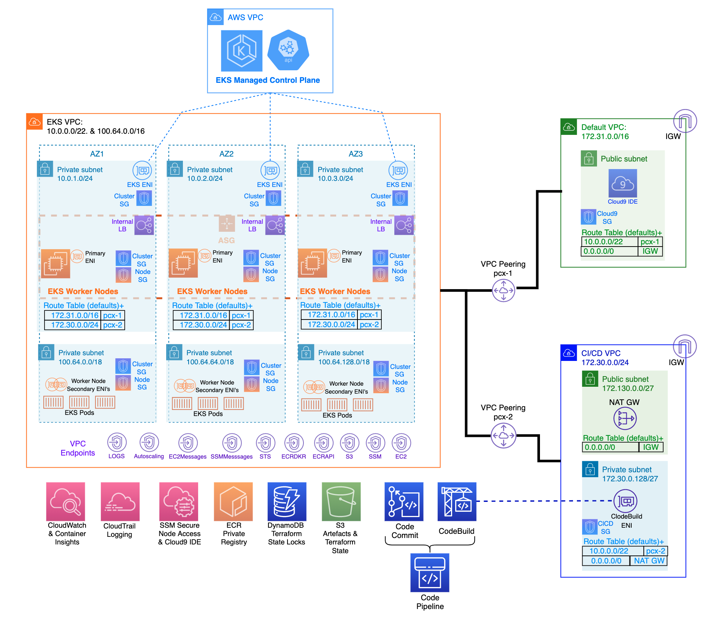

# What is Amazon EKS? 
Amazon EKS (Elastic Kubernetes Service) is a managed Kubernetes service that makes it easy for you to run Kubernetes on AWS and on-premises. Kubernetes is an open-source system for automating deployment, scaling, and management of containerized applications. Amazon EKS is certified Kubernetes-conformant, so existing applications that run on upstream Kubernetes are compatible with Amazon EKS. 
 
Amazon EKS automatically manages the availability and scalability of the Kubernetes control plane nodes responsible for scheduling containers, managing application availability, storing cluster data, and other key tasks. 
 
Amazon EKS lets you run your Kubernetes applications on both Amazon Elastic Compute Cloud (Amazon EC2) and AWS Fargate. With Amazon EKS, you can take advantage of all the performance, scale, reliability, and availability of AWS infrastructure, as well as integrations with AWS networking and security services, such as application load balancers (ALBs) for load distribution, AWS Identity and Access Management (IAM) integration with role-based access control (RBAC), and AWS Virtual Private Cloud (VPC) support for pod networking. 
 
# EKS Architecture 
 
 
 
# Advantages: 
- Deployed and managed via terraform IaC (Infrastructure as Code) 
- Managed Control Plane 
- Service Integrations 
- Hosted Kubernetes Console 
- EKS Add-Ons 
- Managed Node Groups 
- Managed Cluster Update 
- Advanced Workload Support for GPU enabled P2 and P3 Instance types 
- Logging support via CloudWatch 
- Container Insights Monitoring Integration. 
- Serverless Compute using AWS Fargate 
- IAM integration 
- Service Discovery 
- IPV6 Support 
- Compliant with SOC, PCI, ISO, FedRAMP-Mederate, IRAP, C5, KISMS, ENS High, OSPAR, HITRUST CSF and HIPPA eligible service. 
